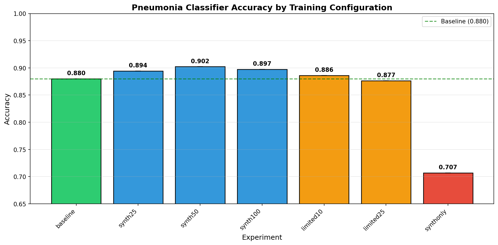
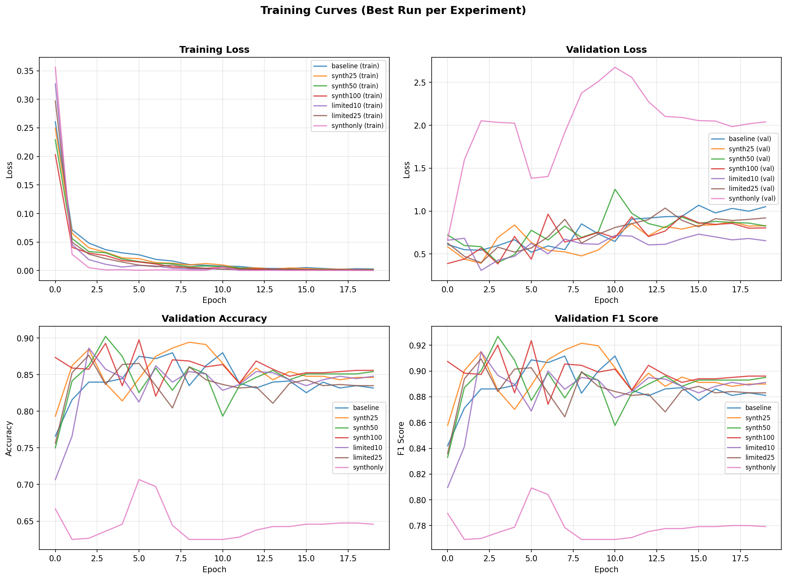
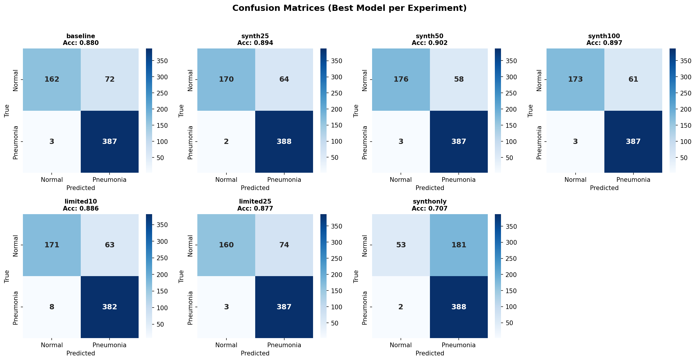
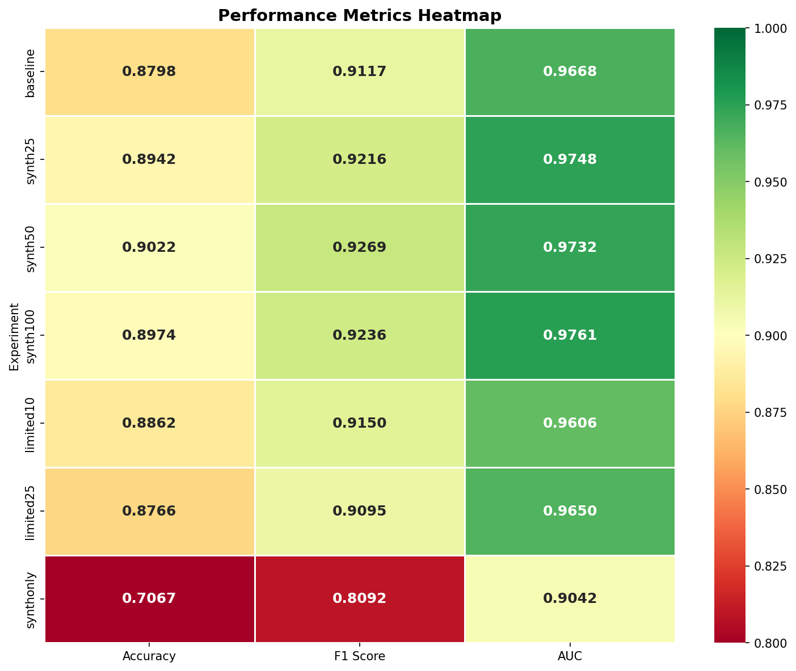

# Synthetic-XRay
Finetuning diffusers for synthetic X-ray image generation

---

## Introduction 

This project aims to address the issue of the lack of high-quality medical images that is publicly available. Obviously large companies like Google can make good models like [MedGemma](https://huggingface.co/collections/google/medgemma-release), but it is important to explore more possiblities.

The purposed solution is to use a diffusion model to synthetically generate chest X-Ray images and use them to train a DenseNet-121 classifier. 

The training and generation notebooks can be found [here](https://github.com/chimbiwide/Synthetic-XRay/tree/main/Notebooks)

---

## Dataset

The primary dataset used was the [hf-vision/chest-xray-pneumonia](https://huggingface.co/datasets/hf-vision/chest-xray-pneumonia), which has 1341 normal chest x-ray and 3975 pneumonia chest x-ray images.
Due to the images having varying dimensions, all images were standardized without distorting aspect ratios by using a Resize, followed by CenterCrop to produce a square 512x512 image.

---

## Diffusion Model Training

A Stable Diffusion 2.1 Base model was fine-tuned using DreamBooth, two models were trained. One for each class on a singel Nvidia A100 80GB GPU.

**Training configuration:**

| Parameter | Value |
|---|---|
| Base model | Stable Diffusion 2.1 Base |
| Method | Full DreamBooth with text encoder training |
| Resolution | 512 × 512 |
| Batch size | 8 (with gradient accumulation of 2, effective batch size 16) |
| Learning rate | 1 × 10⁻⁶ |
| Training epochs | 8 |
| Normal model steps | ~670 |
| Pneumonia model steps | ~1,937 |
| Prior preservation | Enabled (weight = 0.5) |
| Mixed precision | FP16 |

The text encoder was trained alongside the U-Net, and prior preservation was used to maintain diversity in the generated outputs.

The [normal](https://huggingface.co/chimbiwide/cxr-normal-dreambooth) and [pneumonia](https://huggingface.co/chimbiwide/cxr-pneumonia-dreambooth) models are available on HuggingFace.

## Synthetic Image Generation

After fine-tuning, each model was used to 1200 synthetic images (2400 across both images). Generation used the DPM-Solver multistep scheduler with the following parameters, which were tuned iteratively to optimize quality:

| Parameter | Value |
|---|---|
| Inference steps | 50 |
| Guidance scale | 4.0 |
| Batch size | 8 |

The generated synthetic dataset is available on HF: [chimbiwide/synthetic-chest-xray-pneumonia](https://huggingface.co/datasets/chimbiwide/synthetic-chest-xray-pneumonia).

The Fréchet Inception Distance (FID) score was used to measure the quality of the synthetic images. FID compares the statistical distribution of generated images to real images using features extracted from a pretrained Inception network. Lower scores indicate greater similarity to real data.

| Class | FID Score |
|---|---|
| Normal | 61.88 |
| Pneumonia | 64.08 |

The FID scores indicate moderate quality, where the images capture the general sturcture but still not that perfect (FID <  20). The likely cause is the use of DreamBooth during the fine-tuing process, DeamBooth is designed for few-shot learning with a small dataset, but my training contains thousands of images. LoRA may be better suited for larger datasets, it is something to experiment on for later.

---

## Classifier Experiments

**Classifier Architecture**

All classification experiments used DenseNet-121. The classifier head was replaced with a custom two-layer architecture:

- Linear layer (1,024 → 512 units) with ReLU activation
- Dropout (p = 0.5) for regularization
- Linear layer (512 → 2 units) for binary classification

**Training configuration:**

| Parameter | Value |
|---|---|
| Optimizer | AdamW (weight decay = 0.01) |
| Learning rate | 1 × 10⁻⁴ |
| Scheduler | Cosine annealing |
| Batch size | 512 |
| Epochs | 20 |
| Input resolution | 224 × 224 |
| Data augmentation | Random horizontal flip, rotation (±10°), color jitter |

The best model checkpoint was saved based on peak validation accuracy across all epochs. All experiments were trained on a A100 80GB GPU.

**Experiment Design**

Seven experimental configurations were tested to evaluate the impact of synthetic data at different ratios:

| Experiment | Real Data | Synthetic Data | Total Images | Purpose |
|---|---|---|---|---|
| Baseline | 100% (5,216) | 0% | 5,216 | Control group |
| Synth-25 | 100% (5,216) | 25% (600) | 5,816 | Small augmentation |
| Synth-50 | 100% (5,216) | 50% (1,200) | 6,416 | Medium augmentation |
| Synth-100 | 100% (5,216) | 100% (2,400) | 7,616 | Full augmentation |
| Limited-10 | 10% (522) | 100% (2,400) | 2,922 | Severe data scarcity |
| Limited-25 | 25% (1,304) | 100% (2,400) | 3,704 | Moderate data scarcity |
| Synth-Only | 0% | 100% (2,400) | 2,400 | Pure synthetic baseline |

All experiments were evaluated on the same held-out test set of 624 real images (234 normal, 390 pneumonia) to ensure fair comparison. Metrics collected include accuracy, F1 score, area under the ROC curve (AUC), precision, and recall.

All the models are available on HuggingFace: [CXR DenseNet Classifiers](https://huggingface.co/collections/chimbiwide/cxr-densenet-classifiers)

---

## Results

| Experiment | Accuracy | F1 Score | AUC | Δ vs Baseline |
|---|---|---|---|---|
| Baseline | 88.0% | 0.912 | 0.967 | — |
| Synth-25 | 89.4% | 0.922 | 0.975 | **+1.4%** |
| **Synth-50** | **90.2%** | **0.927** | 0.973 | **+2.2%** |
| Synth-100 | 89.7% | 0.924 | **0.976** | **+1.8%** |
| Limited-10 | 88.6% | 0.915 | 0.961 | +0.6% |
| Limited-25 | 87.7% | 0.910 | 0.965 | −0.3% |
| Synth-Only | 70.7% | 0.809 | 0.904 | −17.3% |

The best-performing configuration was **Synth-50** (real data + 50% synthetic), which achieved 90.2% accuracy — a 2.2 percentage point improvement over the 88.0% baseline. All three augmentation experiments (Synth-25, Synth-50, Synth-100) outperformed the baseline across accuracy and F1 score.

The Synth-50 model correctly classified 14 more normal cases than the baseline (176 vs. 162), without sacrificing pneumonia detection. This improvement is directly attributable to the synthetic data helping to address the class imbalance in the original dataset, where normal images are underrepresented (25.7% of training data).

The Synth-Only model demonstrates the limitations of current synthetic image quality: it misclassified 181 out of 234 normal cases as pneumonia, indicating that the synthetic normal images lacked sufficient diagnostic features to teach the classifier what healthy lungs look like.

---

## Observations

The results partially support the hypothesis, when synthetic data is added on top of exsiting real images, it can improve the performance of classifiers, but only by a small percentage.

The confusion matrix shows that the primary way that accuracy increase is class balancing, where there the model correctly classified more normal chest images.

---

## Conclusion

This project demonstrates that synthetic chest X-ray images generated by a fine-tuned diffusion model can improve pneumonia classification accuracy when used to augment real training data. The optimal configuration, which is adding 50% synthetic images to the full real dataset can improve accuracy from 88.0% to 90.2%, with the gains driven primarily by better classification of normal (healthy) cases through improved class balance.

However, the results also reveal important limitations. Synthetic images cannot replace real data: a classifier trained exclusively on synthetic images achieved only 70.7% accuracy. The quality of synthetic images, as measured by FID scores in the 62–64 range, remains below the state of the art, and there exists an optimal augmentation ratio beyond which additional synthetic data provides diminishing returns.

These findings have practical implications for medical AI development. In settings where collecting and annotating additional real medical images is prohibitively expensive or restricted by privacy regulations, synthetic data augmentation offers a viable path to improving model performance by providing synthetic data as a supplement, not substitute for, real clinical images.
